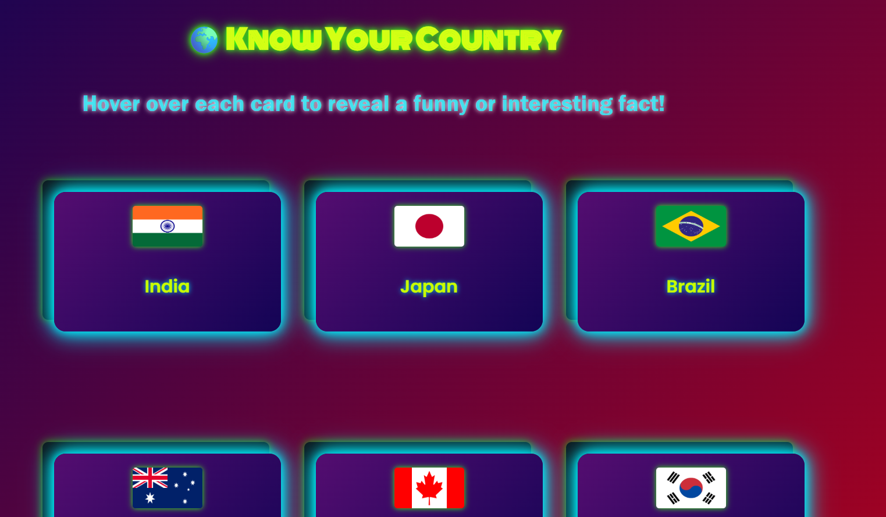
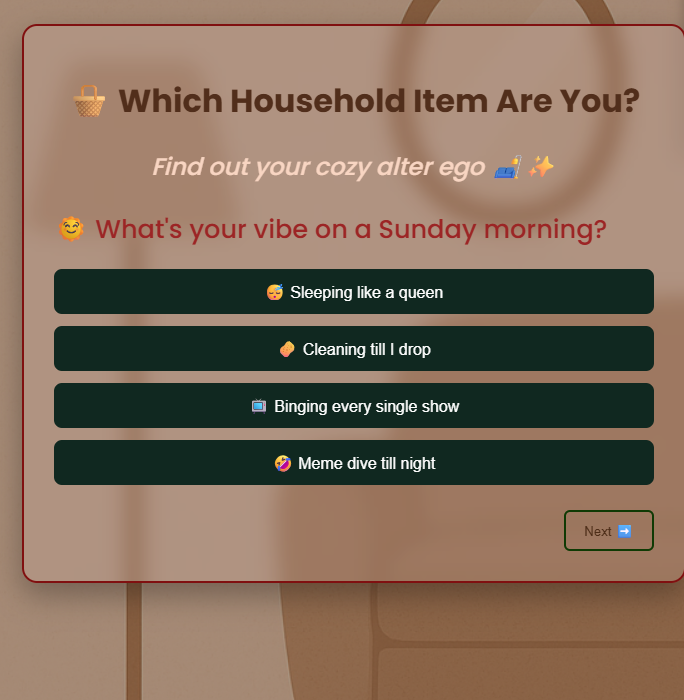
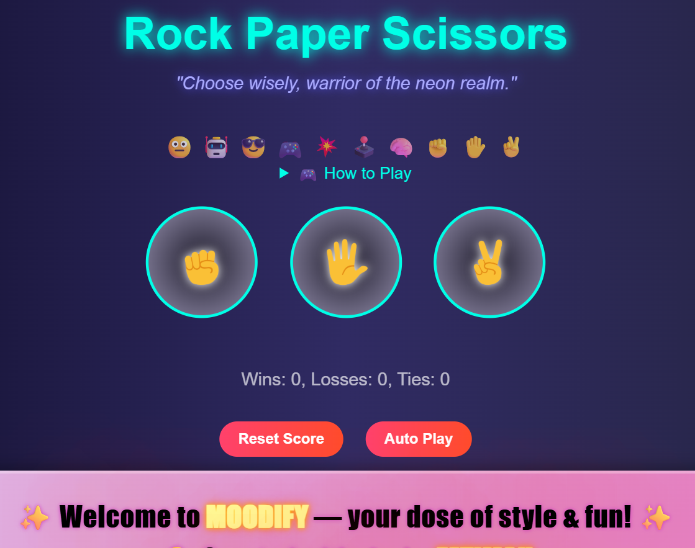

# 🚀 MODIFY – Interactive Learning & Fun Platform

## 📌 Description
MODIFY is an interactive web platform that combines learning and entertainment through quizzes, games, and engaging UI experiences.  
It is built using HTML, CSS, and JavaScript and showcases multiple mini-projects integrated into a single application.

---

## 🌟 Features

### 🌍 Know Your Country
- Flip interactive cards to discover fun facts about different countries  
- Engaging UI with smooth animations  

### 🗣️ Learn Country Language
- Flip cards to explore basic language phrases  
- Includes audio playback to hear pronunciation (e.g., how to say “Hello”)  

### 🏠 Household Personality Quiz
- Fun quiz that analyzes your answers  
- Gives a result based on your personality (which household item you resemble)  

### 🎮 Games Section
- ✊ Rock Paper Scissors Game  
- ⌨️ Fast Typing Challenge (test your typing speed and accuracy)  

---

## 🛠 Technologies Used
- HTML  
- CSS  
- JavaScript  

---

## 🌐 Live Demo
👉 https://fs-blip-ctrl.github.io/DB5/

---

## ▶️ How to Run Locally
1. Download or clone the repository  
2. Open `index.html` in your browser  

---

## 📸 Screenshots

---

## 🎯 Purpose
The goal of this project is to create a platform that combines fun and learning while strengthening frontend development skills such as DOM manipulation, event handling, and UI design.

---

## 📚 Learning Outcomes
- DOM Manipulation  
- Event Handling  
- Interactive UI Design  
- Working with audio in web applications  
- Structuring multiple features into a single project  

---

## 🔮 Future Improvements
- Add more countries and languages  
- Improve UI/UX design  
- Make the website fully responsive  
- Add score tracking and user progress  

---

## 🚀 Live Demo
